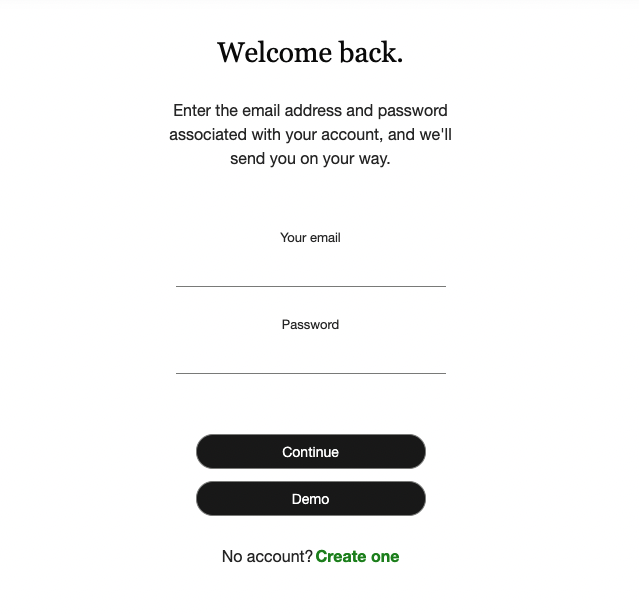
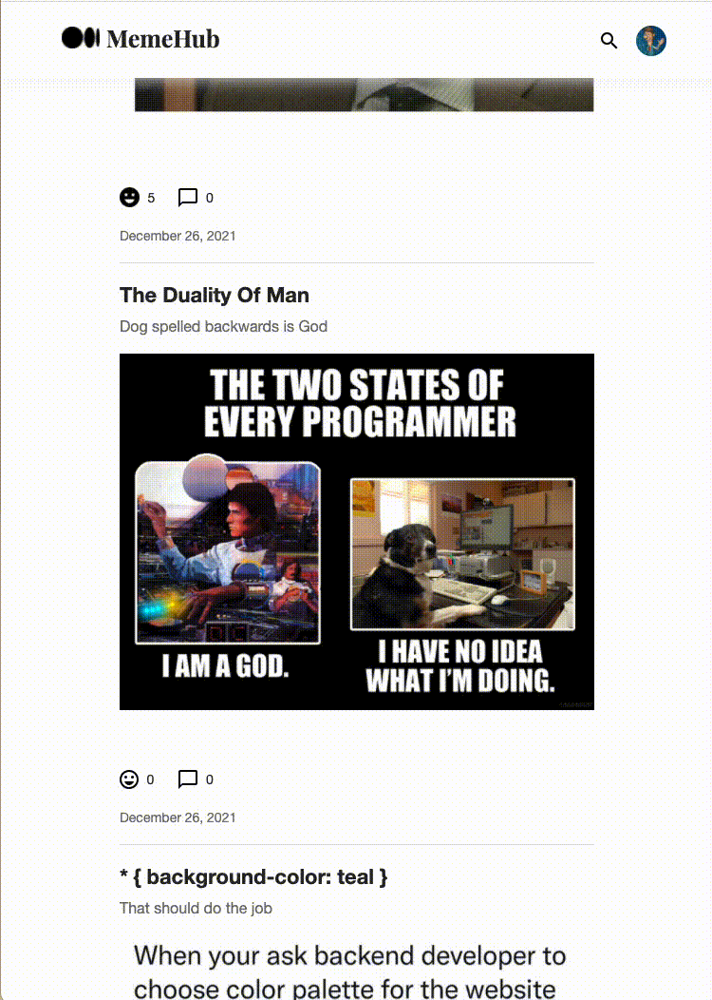

# MemeHub
[MemeHub](http://memehub-medium-clone.herokuapp.com/), a full-stack application inspired by the blogging network Medium, is an online platform for users to share and consume memes.

Visit our [wiki](https://github.com/minuminukim/memehub-express-project/wiki/MemeHub) for more information.

## Live Link
[MemeHub](http://memehub-medium-clone.herokuapp.com/)
## Installation
**Prerequisites**

 - Node.js
 - NPM
 - PostgreSQL

**Get Started**

 - Clone the repository: `git clone git@github.com:minuminukim/memehub-express-project.git`
 - Run `npm install` to install dependencies
 - Create a Postgres database called `memehub_database`
 - Create a `.env` file in the root directory, following `.env.example` as a reference.
 - Initialize the database:
	 - `npx dotenv sequelize db:migrate`
	 - `npx dotenv sequelize db:seed:all`
- Run `npm start` to launch the server.

## Features
 - Account Registration and Sign-In

 - Memes
   - Users can post memes via links.
   - Users can add a title and caption to their post.
   - Users can edit their posts.
   - Users can delete their posts.
 - Comments
   - Users can post comments under memes.
   - Users can edit their own comments.
   - Users can delete their own comments.
 - Like
   - Users can like memes that they find on their feeds.
   - Users can remove their previous likes.

 

 - Follow and Feed
   - Users can follow other users and curate their own feed.
   - Users can view a feed of memes that can be sorted by most likes, most recent, or most engagement.
   - Users can post memes to their own personal pages.

## Technologies

-  JavaScript
-  CSS
-  Pug
-  Node.js
-  Express
-  PostgreSQL
-  Sequelize

## Documentation

- [Feature List](https://github.com/minuminukim/memehub-express-project/wiki/Feature-List)
- [User Stories](https://github.com/minuminukim/memehub-express-project/wiki/User-Stories)
- [Database Schema](https://github.com/minuminukim/memehub-express-project/wiki/Database-Schema)
- [API Documentation](https://github.com/minuminukim/memehub-express-project/wiki/API-Documentation)
- [Frontend Routes](https://github.com/minuminukim/memehub-express-project/wiki/Frontend-Routes)
